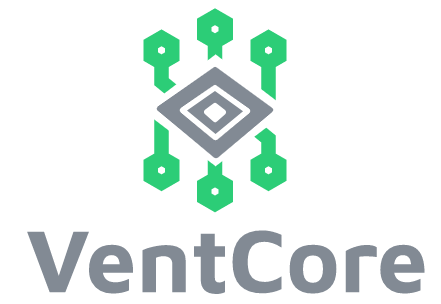

<div id="top"></div>

<!-- PROJECT SHIELDS -->
TODO COMPLETE
<div align="center">

[![Commits][commit-shield]][commit-url]
[![Issues][issues-shield]][issues-url]
[![Team][team-shield]][team-url]
[![Website][website-shield]][website-url]

</div>


<!-- PROJECT LOGO -->
<br />
<div align="center">
  <a href="https://github.com/github_username/repo_name">
    
        
            
  </a>


<!-- DESCRIPTION -->
<h2>UKE M-Lab </h2>

<br />
<a href="https://github.com/github_username/repo_name"><strong>Explore the docs »</strong></a>
<br />
<br />
<a href="https://github.com/github_username/repo_name">View Demo</a>
·
<a href="https://github.com/github_username/repo_name/issues">Report Bug</a>
·
<a href="https://github.com/github_username/repo_name/issues">Request Feature</a>
</p>
</div>

***


<!-- TABLE OF CONTENTS -->
<details style="font-family:Jura">
  <summary>Table of Contents</summary>
  <ol>
    <li>
      <a href="#about-the-project">About The Project</a>
      <ul>
        <li><a href="#built-with">Built With</a></li>
      </ul>
    </li>
    <li>
      <a href="#getting-started">Getting Started</a>
      <ul>
        <li><a href="#prerequisites">Prerequisites</a></li>
        <li><a href="#installation">Installation</a></li>
      </ul>
    </li>
    <li><a href="#usage">Usage</a></li>
    <li><a href="#design">Design</a></li>
    <li><a href="#alarm">Alarm Handling</a></li>
    <li><a href="#dataprocessing">Data Processing</a></li>
    <li><a href="#documentation">Documentation</a></li>
    <li><a href="#known-issues">Known Issues</a></li>
    <li><a href="#contact">Contact</a></li>
    <li><a href="#acknowledgments">Acknowledgments</a></li>
  </ol>
</details>

***


<!-- ABOUT THE PROJECT -->
<div align="justify" style="font-family:Jura">

[![VentCore][product-screenshot]](./ReadMeFiles/ScreenshotMonitoring.png)

This is the Repository for the UKE M-Lab Prototype of VentCore. A Mock-Up for a possible 3-in-1 Medical device which combines a patient Monitor, Defibrillator and Ventilator.
The App in this Repository demonstrates the User-Interface and Alarm Management for such a device in a Tablet Application. This Tablet Application was Designed for a 10" Inch Screen with the Flutter SDK to run on both, Android and iOS.

The Prototype is build with Simulation data designed to mimic real Emergency Scenarios that where provided by Emergency doctors and the friendly Help of [WEINMANN](https://www.weinmann-emergency.com/de/).

The following Sections will guide you through the Installation Proces, Documentation and Functionalities of the Code, The Design and Style Guide used as well as the Data used an how it was processed.

<p align="right">(<a href="#top">back to top</a>)</p>

## Built With

As mentioned, this is a Flutter Tablet application written in [dart]. For the Data Processing and creation we used Python.

* [Flutter](https://flutter.dev/)
* [Dart](https://dart.dev/)
* [Python](https://www.python.org/)

<p align="right">(<a href="#top">back to top</a>)</p>


<!-- GETTING STARTED -->
# Getting Started

To start the Application and Simulate the Scenarios follow the upcoming steps.

## Prerequisites

Please make sure, that you've installed a stable Version of the Flutter SDK. Please consider [this link](https://docs.flutter.dev/get-started/install).

* Verify your working Installation with:

  ```sh
  flutter doctor
  ```

Depending on your operating System make sure to have the Simulator(macOS) or Android Emulator(Windows) Installed and working.

#### Device Recommendations

Since this App was designed with a Requirement of a 10" Inch Tablet Screen with a Resolution of 1920x1200 Pixels, we recommend to use one of the following Emulation Devices:

* **macOS**

``` sh
iPad Pro (3rd generation)
iOS Version 15.2
```
+ **Windows**
# \\TODO: Add Android Version
```sh
Pixel C 
Android Version XXXX 
```

### Installation

1. Clone the Repository.
   ```sh
   git clone https://git.informatik.uni-hamburg.de/mast/teaching/mlab/wt202122/uke
   ```

2. Start the Emulator you want to use. [Device Recommendations](#device)

3. Run Application with Terminal in the Location on your Disk:

   ```sh
   flutter run lib/main.dart
   ```

<p align="right">(<a href="#top">back to top</a>)</p>

***


<!-- USAGE EXAMPLES -->
# Usage

This prototype works as showcase for demonstrating and evaluating of a future 3-in-1 interface with simulated data. 
<br>

|TODO SCREENSHOTS||
|---|---|
|Choose Presets|Set Alarm Limits directly|
[StartScreen]|[AlarmLimit]|
|Switch between Modes|Customize the Screen|
|[DefiScreen]|[Add] <br/>[NIBD]|
|Explore Patient Scenarios|Explore Alarm Behaviour|
|[Scenario]|[RedAlarm]<br/>[YellowAlarm]|

##### For more examples, please refer to the [Documentation](TODOLINK)

<p align="right">(<a href="#top">back to top</a>)</p>

***

For the Design created in Figma please follow this Link:
* [Design Clickdummy](https://www.figma.com/file/ase69ABWTPP8L2kVJdHuzq/MLab---UKE-Protoype-UI?node-id=892%3A6578)

Also have a look at our StyleGuide for the Colors used in the Prototype.

* [Style Guide](../documentation/uke-styleguide.md)

For the design created in Figma please follow this link:
* [Design Clickdummy](https://www.figma.com/proto/ase69ABWTPP8L2kVJdHuzq/MLab---UKE-Protoype-UI?node-id=892%3A3234&scaling=scale-down&page-id=892%3A792&starting-point-node-id=892%3A3234&show-proto-sidebar=1)

Also have a look at our StyleGuide for the colors used in the prototype.

* [Style Guide](../documentation/uke-styleguide-tables.md)

<p align="right">(<a href="#top">back to top</a>)</p>

***

//TODO: Add Description of Alarm Handling Rules
<p align="right">(<a href="#top">back to top</a>)</p>


<!-- LICENSE -->
## Documentation

Please refer to our [Code Documentation](//TODO: add Link to Code Documentation).

<!-- KNOWN ISSUES -->
## Known Issues

1. Issue 1
2. Issue 3

<!-- LICENSE -->
## License


### Auditory alarm according to prioritisation
Alarms are displayed audibly in descending order of priority.


### Auditory Behaviour of Alarms


## General Rules

//TODO: Add Description of Alarm Handling Rules
<p align="right">(<a href="#top">back to top</a>)</p>

***


<!-- DATA PROCESSING -->
# Data Processing

***


<!-- DOCUMENTATION -->
# Documentation

***
<!-- TODO: Add Link-->
Please refer to our [Code Documentation]().


<!-- KNOWN ISSUES -->
# Known Issues

1. Issue 1
2. Issue 3

***


<!-- CONTACT -->
# Contact

##### Project Supervisor
Tim Puhlfrüß - [<tim.puhlfuerss@uni-hamburg.de>](mailto:tim.puhlfuerss@uni-hamburg.de)

##### Development Team
- Maximilian Brosius - [<mail@maxbrosius.de>](mailto:mail@maxbrosius.de)
- Noah Scheld - [ <nickels12er@gmail.com>](mailto: <nickels12er@gmail.com>)
- Mudassar Zahid - [mudassar.zahid@studium.uni-hamburg.de](mailto:mudassar.zahid@studium.uni-hamburg.de) 
- Anni Reinert - [anni@rb-reinert.de](mailto:anni@rb-reinert.de)
- Arne Struck - [<arne.struck@studium.uni-hamburg.de>](mailto:<arne.struck@studium.uni-hamburg.de>)
- Fynn Menk - [fynn.menk@gmail.com](mailto:fynn.menk@gmail.com)

Project Link: [https://git.informatik.uni-hamburg.de/mast/teaching/mlab/wt202122/uke](https://git.informatik.uni-hamburg.de/mast/teaching/mlab/wt202122/uke)

<p align="right">(<a href="#top">back to top</a>)</p>


<!-- ACKNOWLEDGMENTS -->
## Acknowledgments
Special Thanks for the friendly help for the Requirements Elicitation to:
* [Dr. Mahler]() - Emergency Doctor @ UKE Hamburg
* [Dr. Reip]() - Emergency Doctor @ UKE Hamburg
* [Dr. Sasu]() - Emergency Doctor @ UKE Hamburg

And also for providing Simulation / real Patient Data and helping with DataGeneration for the Showcase.
* [Christian Neuhaus](mailto:<C.Neuhaus@weinmann-emt.de>) - WEINAMM Emergency

<p align="right">(<a href="#top">back to top</a>)</p>
</div>


<!-- MARKDOWN LINKS & IMAGES -->
<!-- https://www.markdownguide.org/basic-syntax/#reference-style-links -->
[contributors-shield]: https://img.shields.io/github/contributors/github_username/repo_name.svg?style=for-the-badge
[contributors-url]: https://github.com/github_username/repo_name/graphs/contributors
[forks-shield]: https://img.shields.io/github/forks/github_username/repo_name.svg?style=for-the-badge
[forks-url]: https://github.com/github_username/repo_name/network/members
[stars-shield]: https://img.shields.io/github/stars/github_username/repo_name.svg?style=for-the-badge
[stars-url]: https://github.com/github_username/repo_name/stargazers
[issues-shield]: https://img.shields.io/github/issues/github_username/repo_name.svg?style=for-the-badge
[issues-url]: https://github.com/github_username/repo_name/issues
[license-shield]: https://img.shields.io/github/license/github_username/repo_name.svg?style=for-the-badge
[license-url]: https://github.com/github_username/repo_name/blob/master/LICENSE.txt
[website-shield]: https://img.shields.io/badge/-LinkedIn-black.svg?style=for-the-badge&logo=linkedin&colorB=555
[website-url]: https://linkedin.com/in/linkedin_username
[product-screenshot]: ./ReadMeFiles/ScreenshotMonitoring.png
