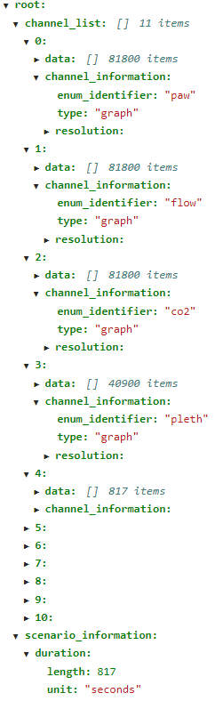
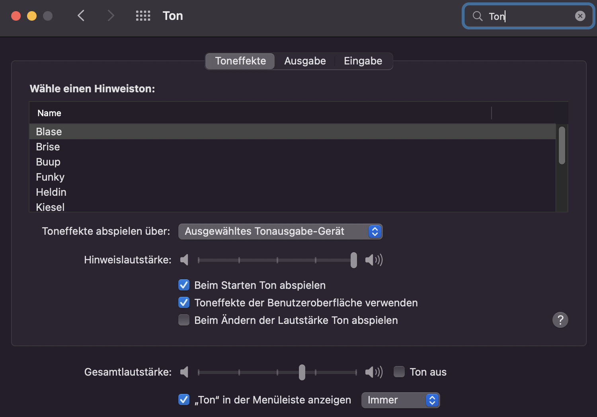

<div id="top"></div>

<!-- PROJECT SHIELDS -->
<div align="center">

[![Commits][commit-shield]][commit-url]
[![Issues][issues-shield]][issues-url]

</div>

<!-- PROJECT LOGO -->
<br />
<div align="center" style="font-family: Jura">
  <a href="https://git.informatik.uni-hamburg.de/mast/teaching/mlab/wt202122/uke">
    
  </a>

<!-- DESCRIPTION -->
<h2>UKE M-Lab </h2>

  <p>
    This is the Repository for the M-Lab Course project VentCore. 
    This Course was held during the WS 2021/2022 by the MAST Team of University of Hamburg

<a href=""><strong>Explore the docs »</strong></a>
<br />
<br />
<a href="https://youtu.be/umgHKt3gESU">View Trailer</a>
·
<a href="">Visit Website</a>
·
</p>
</div>

***


<!-- TABLE OF CONTENTS -->
<details style="font-family:Jura">
  <summary>Table of Contents</summary>
  <ol>
    <li>
      <a href="#about-the-project">About The Project</a>
      <ul>
        <li><a href="#built-with">Built With</a></li>
      </ul>
    </li>
    <li>
      <a href="#getting-started">Getting Started</a>
      <ul>
        <li><a href="#prerequisites">Prerequisites</a></li>
        <li><a href="#installation">Installation</a></li>
      </ul>
    </li>
    <li><a href="#usage">Usage</a></li>
    <li><a href="#design">Design</a></li>
    <li><a href="#alarm">Alarm Handling</a></li>
    <li><a href="#dataprocessing">Data Processing</a></li>
    <li><a href="#documentation">Documentation</a></li>
    <li><a href="#known-issues">Known Issues</a></li>
    <li><a href="#contact">Contact</a></li>
    <li><a href="#acknowledgments">Acknowledgments</a></li>
  </ol>
</details>

***

<!-- ABOUT THE PROJECT -->
<div align="justify" style="font-family:Jura">

# About The Project

![VentCore][product-screenshot]

This is the repository for the UKE M-Lab prototype of VentCore: A Mock-Up for a possible 3-in-1 Medical device which combines a patient Monitoring, Defibrillation and Ventilation.
The App in this repository demonstrates the User-Interface and Alarm-Management for such a device in a Tablet-Application. This Tablet-Application was designed for a 10" Inch Screen with the Flutter SDK to run on both, Android and iOS.
<br/>
The prototype is build with simulation data designed to mimic real emergency scenarios that where provided by emergency doctors of the [UKE](https://www.uke.de/) and the friendly help of [WEINMANN](https://www.weinmann-emergency.com/de/).
<br/>
The following sections will guide you through the installation process, documentation and functionalities of the code, the design and [Style Guide](/App/documentation/uke-styleguide-tables.md) used as well as the data used an how it was processed.

<p align="right">(<a href="#top">back to top</a>)</p>

## Built With

As mentioned, this is a Flutter Tablet application written in **dart**. For the Data Processing and creation we used **Python**.

* [Flutter](https://flutter.dev/)
* [Dart](https://dart.dev/)
* [Python](https://www.python.org/)

<p align="right">(<a href="#top">back to top</a>)</p>


<!-- GETTING STARTED -->
# Getting Started

To start the Application and Simulate the Scenarios follow the upcoming steps.

## Prerequisites

Please make sure, that you've installed a stable Version of the Flutter SDK. Please consider [this link](https://docs.flutter.dev/get-started/install).

* Verify your working Installation with:

  ```sh
  flutter doctor
  ```

Depending on your operating system make sure to have the simulator(macOS) or Android Emulator(Windows) installed and working.

<div id="device"></div>

## Device Recommendations

Since this App was designed with a requirement of a 10" Inch tablet screen with a resolution of 1920x1200 pixels, we recommend to use one of the following emulation devices:

* **macOS**

``` sh
iPad Pro (3rd generation)
iOS Version 15.2
```

+ **Windows**

```sh
Pixel C 
Android Version 11.0 x86
```

## Installation

1. Clone the repository.

    ```sh

   git clone https://git.informatik.uni-hamburg.de/mast/teaching/mlab/wt202122/uke

   ```

2. Start the emulator you want to use. [Device Recommendations](#device)

3. Run Application with terminal in the location on your disk:

   ```sh
   flutter run lib/main.dart
   ```

<p align="right">(<a href="#top">back to top</a>)</p>

***

<!-- USAGE EXAMPLES -->
# Usage

This prototype works as showcase for demonstrating and evaluating of a future 3-in-1 interface with simulated data. 
<br>
|||
|---|---|
|Choose Presets|Explore Patient Scenarios|
|![StartScreen]|![Scenario]|
|Switch between Modes via Buttons|Set Limits directly and add Graph|
|![threemodes]|![Add]|
|Ventilation|Defibrillator|
|![product-screenshot]|![DefiScreen]|
|High Alarms|Overview of All Alarmlimits|
|![redalarm]|![limits]|

##### For more examples, please refer to the [Documentation](TODOLINK)

##### For more examples, please refer to the [Documentation](TODOLINK)

<p align="right">(<a href="#top">back to top</a>)</p>

***

<!-- DESIGN -->
# Design

* [Style Guide](../documentation/uke-styleguide-tables.md)

<p align="right">(<a href="#top">back to top</a>)</p>

***

<!-- ALARM HANDLING -->
# Alarm Handling
For a complete overview, please refer to our [AlarmLogic.md](TODO LINK)

### Priotising alarms in categories
Parameter alarms are prioritised according to the severity of their deviations from the set alarm limits. The `SensorDeviation` is defined in percent for each parameter.

#### Example:

  ```shell

  Parameter: Heartfrequency
  Upper Limit: 120
  SensorDeviation: 0.1
  Middle Alert: 120 < currentValue < 131
  High Alert: currentValue >131

  ```

### Auditory alarm according to prioritisation
Alarms are displayed audibly in descending order of priority.


### Auditory Behaviour of Alarms

## General Rules

//TODO: Add Description of Alarm Handling Rules
<p align="right">(<a href="#top">back to top</a>)</p>


<!-- DATA PROCESSING -->
# Data Processing

***


<!-- DOCUMENTATION -->
# Documentation

***
<!-- TODO: Add Link-->
Please refer to our [Code Documentation]().


<!-- KNOWN ISSUES -->
# Known Issues

1. Issue 1
2. Issue 3

***

<!-- DATA PROCESSING -->
# Data Processing

***


<!-- DOCUMENTATION -->
# Documentation

***
<!-- TODO: Add Link-->
Please refer to our [Code Documentation]().


<!-- KNOWN ISSUES -->
# Known Issues

1. Issue 1
2. Issue 3

***

<!-- DATA PROCESSING -->
# Data Processing
Files to consider:
- [Notebook 1](./SimulationData/data_processing.ipynb)
- [Notebook 2](./SimulationData/weinmanndata.ipynb)
- [Raw Data](./SimulationData/rawdata.ipynb)

Mr. Neuhaus from Weinmann provided us with with data twice, once actual recorded ventilation and ECG data and the second time generated simulation data.

As the patient scenarios are very complex finding data that fits our needs is near impossible. Even just finding a healthy ECG wave is a very hard task. Thats why we are building our datasets ourselfs.

The first time we received an "edf" file containing recorded ventilation and ECG data.
since this was a raw recording and not filtered or treated in any way we had to process the data which we did in [Notebook 1](./SimulationData/data_processing.ipynb).

We used a python library called [mne](https://mne.tools/stable/index.html) to read the "edf" file and extract relevant information.  

Since we immediately wanted to visualize the provided data within our application, we did not bother constructing a complex json file. Thus we built a simple list holding dictionaries for each graph (ECG, paw, pleth, etc.).

Since the data is raw and unfiltered a lot of noise was present, to filter out the noise Mr. Neuhaus recomended us to use a algorithm called [simple moving average](https://en.wikipedia.org/wiki/Moving_average).
Our implementation of the simple moving average can be found in this [Notebook 1](./SimulationData/data_processing.ipynb) under the section "Simple Moving Average".
This provided us with a clean ECG wave we could use to display the ECG channel in our application.
After finishing up the data for our graphs we realized that this is only half the data our application needs to be realistic enough for our customer.

Thankfully Mr.Neuhaus provided us with clean simulated data. Using this data we redesinged our json datastructure.

### General Data Structure

We were now able to display an ECG wave as a graph. However for a realistic representation of the associated heartfrequency we would have to analyze the number of pqrst complexes in one minute. Which would have taken to much time to implement correctly, we decided against analyzing our graphs. We still lacked a datasource to realisticly display a heartfrequency. 

Our most basic approach was generating semi random numbers and just display those. The problem that arrises with random generated numbers is that a random datapoint is not depended on its predecessor. In the realm of medical data this leads to serious inconsistencies. Since the heartfrequency might be 120 at time x and 75 the next timestep this does not mimic a realistic trend for a heartfrequency (even in the most dramatic cases hf would not drop by that much). 

To tackle this issue we decided to generate our heartfrequency with an algorithm called random walk. A [random walk](https://en.wikipedia.org/wiki/Random_walk) generates a list of values each based on the last value to allow for a more realistic trend . Our implementation of a random walk can be found under the section "Random Walk" in the notebook. The relationship between ECG and heartfrequency is not unique and almost every graph brings its associated value (i.e. pleth -> spo2, co2 -> co2Absolute). With our strategy we were able to generate all the datastreams necessary.

### Json Structure


|Every scenario and our standard scenario have a dedicated json file. On the top level one can find a list containing all the (sensor)channels needed, and general information for the scenario such as the duration. A channel can contain data for either a graph or one of the absolute values that are associated to the graphs and channel information. The data just holds a list of all the datapoints. Channel information provides useful descriptions and important parameters such as the enum identifier and the resolution. The resolution is stated in Hz.

### Building scenario data

With a combination of the random walk and the clean, easily loopable data we recieved, we had the tools to construct any scenario we wanted. Now that we had all the basic components needed we tried to replicate the given patient scenarios as close as possible.

<!-- DOCUMENTATION -->
# Documentation

***
<!-- TODO: Add Link-->
Please refer to our [Code Documentation]().

<!-- KNOWN ISSUES -->
# Known Issues

1. Issue 1
2. Issue 3

***


### Auditory alarm according to prioritisation
Alarms are displayed audibly in descending order of priority.


### Auditory Behaviour of Alarms


## General Rules

//TODO: Add Description of Alarm Handling Rules
<p align="right">(<a href="#top">back to top</a>)</p>

***


<!-- DATA PROCESSING -->
# Data Processing
Files to consider:
- [Notebook 1](./SimulationData/data_processing.ipynb)
- [Notebook 2](./SimulationData/weinmanndata.ipynb)
- [Raw Data](./SimulationData/rawdata.ipynb)

Mr. Neuhaus from Weinmann provided us with with data twice, once actual recorded ventilation and ECG data and the second time generated simulation data.

As the patient scenarios are very complex finding data that fits our needs is near impossible. Even just finding a healthy ECG wave is a very hard task. Thats why we are building our datasets ourselfs.

The first time we received an "edf" file containing recorded ventilation and ECG data.
since this was a raw recording and not filtered or treated in any way we had to process the data which we did in [Notebook 1](./SimulationData/data_processing.ipynb).

We used a python library called [mne](https://mne.tools/stable/index.html) to read the "edf" file and extract relevant information.  

Since we immediately wanted to visualize the provided data within our application, we did not bother constructing a complex json file. Thus we built a simple list holding dictionaries for each graph (ECG, paw, pleth, etc.).

Since the data is raw and unfiltered a lot of noise was present, to filter out the noise Mr. Neuhaus recomended us to use a algorithm called [simple moving average](https://en.wikipedia.org/wiki/Moving_average).
Our implementation of the simple moving average can be found in this [Notebook 1](./SimulationData/data_processing.ipynb) under the section "Simple Moving Average".
This provided us with a clean ECG wave we could use to display the ECG channel in our application.
After finishing up the data for our graphs we realized that this is only half the data our application needs to be realistic enough for our customer.

Thankfully Mr.Neuhaus provided us with clean simulated data. Using this data we redesinged our json datastructure.

### General Data Structure

We were now able to display an ECG wave as a graph. However for a realistic representation of the associated heartfrequency we would have to analyze the number of pqrst complexes in one minute. Which would have taken to much time to implement correctly, we decided against analyzing our graphs. We still lacked a datasource to realisticly display a heartfrequency. 

Our most basic approach was generating semi random numbers and just display those. The problem that arrises with random generated numbers is that a random datapoint is not depended on its predecessor. In the realm of medical data this leads to serious inconsistencies. Since the heartfrequency might be 120 at time x and 75 the next timestep this does not mimic a realistic trend for a heartfrequency (even in the most dramatic cases hf would not drop by that much). 

To tackle this issue we decided to generate our heartfrequency with an algorithm called random walk. A [random walk](https://en.wikipedia.org/wiki/Random_walk) generates a list of values each based on the last value to allow for a more realistic trend . Our implementation of a random walk can be found under the section "Random Walk" in the notebook. The relationship between ECG and heartfrequency is not unique and almost every graph brings its associated value (i.e. pleth -> spo2, co2 -> co2Absolute). With our strategy we were able to generate all the datastreams necessary.

### Json Structure


|Every scenario and our standard scenario have a dedicated json file. On the top level one can find a list containing all the (sensor)channels needed, and general information for the scenario such as the duration. A channel can contain data for either a graph or one of the absolute values that are associated to the graphs and channel information. The data just holds a list of all the datapoints. Channel information provides useful descriptions and important parameters such as the enum identifier and the resolution. The resolution is stated in Hz.

### Building scenario data

With a combination of the random walk and the clean, easily loopable data we recieved, we had the tools to construct any scenario we wanted. Now that we had all the basic components needed we tried to replicate the given patient scenarios as close as possible.

<!-- DOCUMENTATION -->
# Documentation

<!-- TODO: Add Link-->
- Please refer to our [Code Documentation]()
- Application [Styleguide](/App/documentation/uke-styleguide-tables.md)
- Approaches and Logic for [Alarmmangement]()
- [UseCases](./documentation/UseCase-English.pdf) for Testing
 
- [Figma-Clickdummy](https://www.figma.com/proto/ase69ABWTPP8L2kVJdHuzq/MLab---UKE-Protoype-UI?node-id=892%3A3234&scaling=scale-down&page-id=892%3A792&starting-point-node-id=892%3A3234&show-proto-sidebar=1)


<!-- KNOWN ISSUES -->
# Known Issues

**1. Sound Problems with MacOS and Simulator**

  If you are using a Mac and you are simulating an iPad over XCode and the Simulator, please make sure, that you have enabled the sound in settings. Also playing sounds with the Mac speakers can lead to sound issues. Please consider using headphones.
  
  ***

**2. [Add-Button ValueTiles for the right side missing](https://git.informatik.uni-hamburg.de/mast/teaching/mlab/wt202122/uke/-/issues/121)**

Adding an absolute sensor on the right side of the screen is currently missing.

***

**3. [Audioplayer output in Debug Console]()**

This seems to be a known issue with the [audioplayer](https://github.com/bluefireteam/audioplayers/issues/707).
If you want to disable the output, please filter your console. To exclude certain output, use ***!excludeText***
***

**4. [Delayed Alarm Sounds]()**

Alarms sound don't start right away. This seems to be a problem of Audioplayer and Timer. Initial start should be directly.

***

**5. [Alarms disappear too quickly]()**

Alarms should be visualized at least 10 seconds before it can update to a lower alarm. 

***

**6. [Server Issues with Pipeline](https://git.informatik.uni-hamburg.de/mast/teaching/mlab/wt202122/uke/-/issues/59)**

The pipeline for the project couldn't be started due to server issues.

***

<!-- CONTACT -->
# Contact

##### Project Supervisor
Tim Puhlfürß - [<tim.puhlfuerss@uni-hamburg.de>](mailto:tim.puhlfuerss@uni-hamburg.de)

##### Development Team
- Corvin Biebach - [corvin.biebach@studium.uni-hamburg.de](mailto:corvin.biebach@studium.uni-hamburg.de)
- Maximilian Brosius - [mail@maxbrosius.de](mailto:mail@maxbrosius.de)
- Fynn Menk - [fynn.menk@gmail.com](mailto:fynn.menk@gmail.com)
- Anni Reinert - [anni.reinert@rb-reinert.de](mailto:anni@rb-reinert.de)
- Noah Scheld - [nickels12er@gmail.com](mailto:nickels12er@gmail.com)
- Arne Struck - [arne.struck@studium.uni-hamburg.de](mailto:arne.struck@studium.uni-hamburg.de)
- Mudassar Zahid - [mudassar.zahid@studium.uni-hamburg.de](mailto:mudassar.zahid@studium.uni-hamburg.de) 

Project Link: [UHH Informatics GitLab EE ](https://git.informatik.uni-hamburg.de/mast/teaching/mlab/wt202122/uke)

<p align="right">(<a href="#top">back to top</a>)</p>

<!-- ACKNOWLEDGMENTS -->
# Acknowledgments
Special Thanks for the friendly help for the Requirements Elicitation and medical questions to:
* [Dr. Mahler](mailto:an.mahler@uke.de) - Emergency Doctor @ UKE Hamburg
* [Dr. Reip](mailto:w.reip@uke.de) - Emergency Doctor @ UKE Hamburg
* [Dr. Sasu](mailto:p.sasu@uke.de) - Emergency Doctor @ UKE Hamburg

And also for providing simulation / real patient data and helping with DataGeneration for the Showcase.
* [Christian Neuhaus](mailto:C.Neuhaus@weinmann-emt.de) - WEINMANN Emergency

<p align="right">(<a href="#top">back to top</a>)</p>
</div>

<!-- MARKDOWN LINKS & IMAGES -->
[issues-shield]: https://img.shields.io/badge/issues-162-brightgreen
[issues-url]: https://git.informatik.uni-hamburg.de/mast/teaching/mlab/wt202122/uke/-/issues

[commit-shield]:https://img.shields.io/badge/commits-1010-orange
[commit-url]:https://git.informatik.uni-hamburg.de/mast/teaching/mlab/wt202122/uke/-/commits/main

[product-screenshot]: ./ReadMeFiles/Screenshots/ventilation2-black.png
[monitoring]: ./ReadMeFiles/Screenshots/monitoring.png
[ventilation]:./ReadMeFiles/Screenshots/ventilation.png
[StartScreen]:./ReadMeFiles/Screenshots/presets.png
[AlarmLimit]: ./ReadMeFiles/Screenshots/alarmlimit.png
[DefiScreen]:./ReadMeFiles/Screenshots/cpr.png
[Add]:./ReadMeFiles/Screenshots/monitoring-add-limit.png
[Scenario]:./ReadMeFiles/Screenshots/scenarios.png
[RedAlarm]:./ReadMeFiles/Screenshots/red-alarms.png
[threemodes]:./ReadMeFiles/Screenshots/3in1.png
[limits]:./ReadMeFiles/Screenshots/limits.png

[Table Audio Priorities]:./ReadMeFiles/table-audio-priority.png
