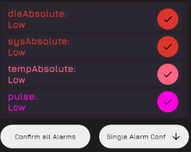

The widgets in this topic are responsible for muting single absolute value alarms. It provides the functionality of opening a pop-up window with a list of all the absolute value alarms.
These absolute value alarm list entries can also be confirmed individually.

