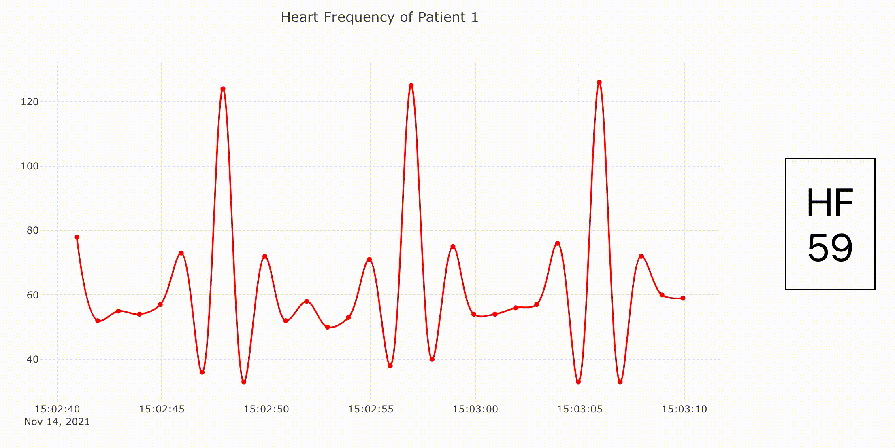

# Firebase React Test

<span align="center">

</span>

## Installation
Install required modules and run the project with your preferred package manager (`npm` or `yarn`), i.e.:
 ```sh
 cd firebase-react-test
 yarn install
 yarn start
 ```
